# Pomodoro App Architecture

This document describes the high-level architecture of the Pomodoro application, explains the main components, shows the data and control flow, and lists the design decisions and trade-offs that drove the implementation.

```mermaid
graph TD
    Frontend[Frontend] --> UI[UI Components]
    UI --> History[History Components]
    UI --> Layout[Layout]
    UI --> ModeSelector[Mode Selector]
    UI --> Projects[Projects UI]
    UI --> ProjectSelector[Project Selector]
    UI --> Settings[Settings UI]
    UI --> Timer[Timer UI]
    Frontend --> Hooks[Custom Hooks]
    Hooks --> useTimer[useTimer]
    Hooks --> useProjects[useProjects]
    Hooks --> useSettings[useSettings]
    Hooks --> useExport[useExport]
    Frontend --> Services[Services]
    Services --> TimerService[TimerService]
    Services --> ExportService[ExportService]
    Services --> StorageService[StorageService]
    Services --> Repositories[Repositories]
    Repositories --> PomodoroRepository[PomodoroRepository]
    Repositories --> ProjectRepository[ProjectRepository]
    Repositories --> SettingsRepository[SettingsRepository]
    Frontend --> State[State Management]
    State --> Store[Zustand / Local state]
    Frontend --> Routing[Pages]
    Routing --> TimerPage[TimerPage]
    Routing --> ProjectsPage[ProjectsPage]
    Routing --> SettingsPage[SettingsPage]
    Routing --> HistoryPage[HistoryPage]
    Frontend --> PWA[Service Worker / PWA]
    PWA --> sw[sw.js]
    PWA --> manifest[manifest.webmanifest]
```

**Overview**
- **Purpose:** small, single-page Pomodoro timer app implemented with React and Vite. The app focuses on fast interactions, offline-capable persistence (PWA), and small memory footprint.
- **Primary concerns:** accurate timer behavior, durable session storage, export/backup, and a lightweight UI.

**Component breakdown**
- **Frontend (React + Vite):** app entrypoint and build system. See [src/main.tsx](src/main.tsx) and [index.html](index.html).
- **UI Components:** presentational components grouped under `src/components/` (Timer, Projects, Settings, History). They render state and emit user intents (events).
- **Custom Hooks:** encapsulate behavioral logic and are used by components to access timer mechanics, settings, projects, and export features. Notable hooks: `useTimer`, `useProjects`, `useSettings`, `useExport` (see `src/hooks/`).
- **Services:** thin application services providing higher-level operations like `TimerService`, `ExportService`, and `StorageService` (see `src/services/`). They coordinate repositories and lower-level APIs.
- **Repositories:** small adapters that read/write domain objects from the chosen storage (localStorage / IndexedDB). Examples: `PomodoroRepository`, `ProjectRepository`, `SettingsRepository` under `src/services/`.
- **State Management:** a lightweight local store (Zustand or React state hooks) holds current session state, UI settings, and short-lived values. Persistent state is synced to repositories.
- **Routing / Pages:** top-level pages under `src/pages/` map UI routes to page components (TimerPage, ProjectsPage, SettingsPage, HistoryPage).
- **PWA / Service Worker:** `public/sw.js` and `public/manifest.webmanifest` enable offline behavior, caching of assets and (optionally) background sync for exports.

**Data & Control Flow**
- User interacts with UI components → events call hook methods (e.g., `start()`, `pause()`, `completeSession()`).
- Hooks delegate to `TimerService` for time calculations and session lifecycle.
- Services persist session summaries and app settings via repositories which use `StorageService` (wrapping localStorage / IndexedDB).
- Export flows use `ExportService` which reads historical records from `PomodoroRepository`, formats CSV/JSON, and triggers downloads.
- State updates are kept minimal and authoritative source-of-truth for persisted data is the repositories.

**Reasoning & Trade-offs**
- Single-page React app: chosen for developer ergonomics, small bundle size with Vite, and easy component-based UI composition.
- Hooks-first design: keeps side effects and imperative logic out of components; logic lives in testable hooks / services.
- Local persistence (localStorage / IndexedDB) instead of a backend: aligns with the app's offline-first PWA goal and avoids server complexity for a personal productivity tool.
- Lightweight state (Zustand / hooks) vs heavy external state managers: avoids boilerplate and keeps the app simple. The store is used for UI/short-lived session state while repositories handle durable data.
- Service / Repository separation: makes persistence pluggable (swap localStorage for IndexedDB or remote API) and centralizes side effects for easier testing.

**Testing & Observability**
- Unit tests live alongside hooks and services (`src/hooks/*.test.ts`, `src/services/*.test.ts`). Tests focus on deterministic behavior: timer state transitions, persistence, and export formatting.
- CI: run `npm run test` for the Vitest suite (see `package.json`).

**Extensibility & Migration Paths**
- To add cloud sync: implement a remote repository that satisfies the repository interface and wire it behind `SettingsRepository` with toggleable sync.
- To improve timing precision: move timing logic into a Web Worker or use high-resolution timers and compensate on resume from background.

**Where to look in the codebase**
- Components: `src/components/`
- Hooks: `src/hooks/`
- Services & Repositories: `src/services/`
- Pages: `src/pages/`
- PWA assets: `public/sw.js`, `public/manifest.webmanifest`
